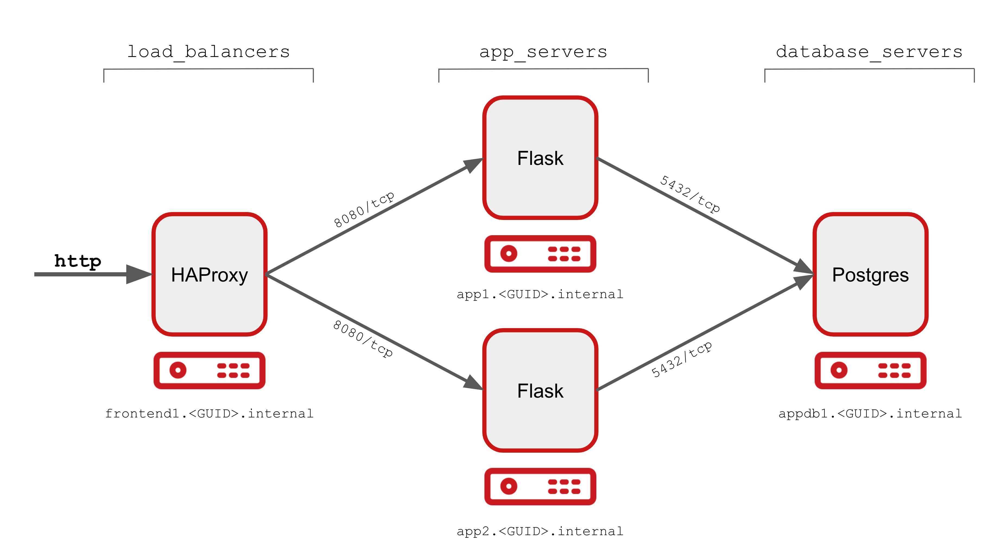

=== Overview

==== Quick Start

. Deploy

+
[source,bash]
----
ansible-playbook main.yml
----

=== Overall Architecture 

=== Outline of main flow

* common
** setup yum repos (via satellite)
** setup firewalld
* setup postgres
** firewalld rule opening 5432
** install postgres 10
** no data load phase - come back to that?
* setup app tier
** firewalld rule opening 443

=== Development Environment

==== Deploying the Database Tier

=== Notes:

Does firewalld need to be configured?

=== Resources

* Jeff Geerling's Ansible Galaxy Role
* Useful articles on Postgres
** Setting it up from scratch

https://opensource.com/article/17/6/ansible-postgresql-operations
  

== Credits

* Aditya Patawari and Vikas Aggarwal
** I used their phone app during debugging
** Shout out for their Ansible Automation Cookbook
* Jeff Geerlinguy for his Ansible Galaxy Postgres Role

